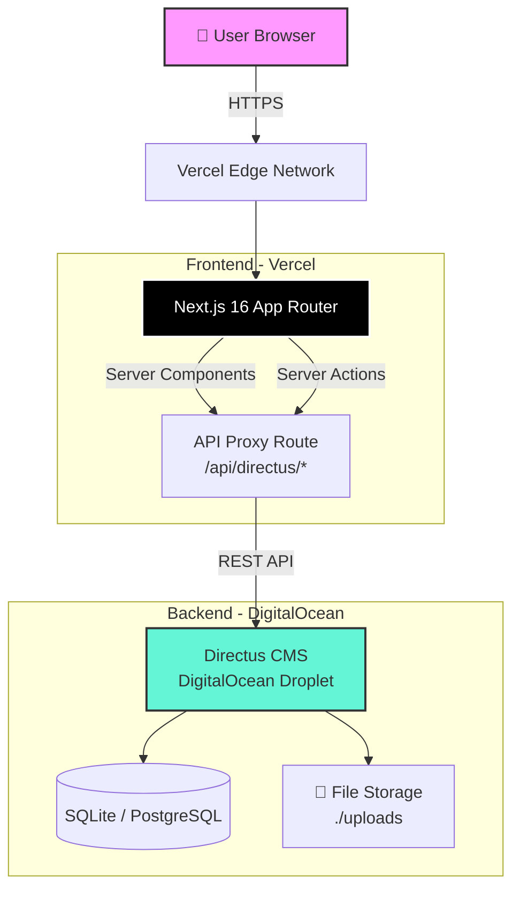

# 🚀 ServiceFinder UAE — Professional README.md

Here's a powerful, portfolio-grade README that showcases your technical depth and makes a strong impression for PhD applications:

```markdown
# 🇦🇪 ServiceFinder UAE — EasyFinder

<div align="center">

### Find Trusted Service Providers Across the UAE

**A modern, full-stack vendor directory connecting users with verified local service providers — from plumbers and electricians to wedding planners and IT support.**

[](https://nextjs.org/)
[](https://www.typescriptlang.org/)
[](https://directus.io/)
[](https://tailwindcss.com/)
[](https://vercel.com/)
[](https://www.digitalocean.com/)

[🌐 Live Demo](https://vendor-directory-eight.vercel.app/) • [📖 Documentation](#-documentation) • [🐛 Report Bug](https://github.com/leeblaab/vendor-directory/issues) • [💡 Request Feature](https://github.com/leeblaab/vendor-directory/issues)

</div>

---

## 📋 Table of Contents

- [Overview](#-overview)
- [Features](#-features)
- [Tech Stack](#-tech-stack)
- [Architecture](#-architecture)
- [Project Structure](#-project-structure)
- [Getting Started](#-getting-started)
- [Environment Variables](#-environment-variables)
- [Deployment](#-deployment)
- [Data Model](#-data-model)
- [Roadmap](#-roadmap)
- [Screenshots](#-screenshots)
- [Contributing](#-contributing)
- [License](#-license)
- [Developer](#-developer)

---

## 🎯 Overview

**ServiceFinder UAE** (branding as **EasyFinder**) is a production-ready, full-stack web application designed to solve a real problem in the UAE market: finding trusted local service providers. 

Built with a modern JavaScript stack and deployed on cloud infrastructure, the platform serves as both a **functional product** and a **technical case study** in:
- Modern full-stack web architecture
- Headless CMS integration
- Cloud deployment and DevOps
- Real-world digital transformation

> 💡 **Why this matters:** This project bridges 15+ years of industrial experience with modern digital technologies — demonstrating the ability to ship production systems, not just prototypes.

---

## ✨ Features

### 🏠 Core Platform
- ✅ **60 Service Categories** — From Movers and Plumbers to Smart Home Installation and Solar Panel services
- ✅ **Dynamic Category Filtering** — Real-time filtering with URL-based state management
- ✅ **Global Search** — Full-text search across all vendors with instant results
- ✅ **Interactive Maps** — Leaflet + OpenStreetMap integration for vendor locations
- ✅ **Responsive Design** — Mobile-first, works flawlessly on all devices
- ✅ **Light/Dark Mode** — System preference detection + manual toggle

### 👤 User System
- ✅ **User Registration & Authentication** — JWT-based auth with refresh tokens
- ✅ **Vendor Submission Portal** — Multi-step wizard for authenticated users
- ✅ **Reviews & Ratings** — 5-star rating system with upvote/downvote on reviews
- ✅ **User Dashboards** — Track submissions and reviews (coming soon)

### 🎨 UX & Design
- ✅ **Modern Animations** — Boids ecosystem hero, wave-reveal text, flip cards (Animata components)
- ✅ **Skeleton Loading States** — Smooth UX during data fetching
- ✅ **SEO Optimized** — JSON-LD structured data, dynamic sitemaps, OpenGraph tags
- ✅ **PWA Ready** — Progressive Web App manifest for mobile installability

### 🔐 Security & Performance
- ✅ **API Proxy Layer** — CORS bypass with path-based routing
- ✅ **Permission-Based Access** — Directus role-based security model
- ✅ **Image Optimization** — Next.js Image component with automatic optimization
- ✅ **Server-Side Rendering** — SEO-friendly, fast initial page loads

---

## 🛠️ Tech Stack

### Frontend
| Technology | Version | Purpose |
|------------|---------|---------|
| **Next.js** | 16.2.6 | React framework with App Router & Turbopack |
| **React** | 19.2.4 | UI library |
| **TypeScript** | 5.0 | Type-safe development |
| **Tailwind CSS** | 4.0 | Utility-first styling |
| **shadcn/ui** | Latest | Accessible component library |
| **Framer Motion** | Latest | Production-ready animations |
| **Leaflet** | Latest | Interactive maps |
| **Lucide React** | Latest | Modern icon set |

### Backend
| Technology | Version | Purpose |
|------------|---------|---------|
| **Directus** | 11.17.4 | Headless CMS & REST API |
| **PostgreSQL** | 16 | Primary database (production) |
| **SQLite** | - | Lightweight database (development) |
| **Docker** | 29.6.1 | Containerization |
| **Docker Compose** | 5.2.0 | Multi-container orchestration |

### Infrastructure
| Service | Purpose |
|---------|---------|
| **Vercel** | Frontend hosting with edge network |
| **DigitalOcean** | Backend hosting (Droplet in Frankfurt) |
| **GitHub** | Source control & CI/CD |

---

## 🏗️ Architecture



### Key Architectural Decisions

1. **API Proxy Pattern** — All Directus calls route through `/api/directus/[...path]` to:
   - Bypass CORS restrictions
   - Centralize authentication
   - Hide backend URL from client bundles
   
2. **Server-First Data Fetching** — Data is fetched in Server Components for:
   - Better SEO (content in initial HTML)
   - Faster Time-to-First-Byte
   - Reduced client-side JavaScript

3. **Headless CMS** — Directus provides:
   - Admin UI for content management
   - Auto-generated REST API
   - Role-based permissions
   - File asset management

---

## 📁 Project Structure

```
vendor-directory/
├── src/
│   ├── app/                      # Next.js App Router
│   │   ├── api/directus/[...path]/  # API Proxy Route
│   │   ├── vendors/              # Vendor listing & detail pages
│   │   │   ├── page.tsx          # /vendors
│   │   │   ├── [slug]/page.tsx   # /vendors/{slug}
│   │   │   └── components/       # Vendor-specific components
│   │   ├── search/               # Global search
│   │   ├── submit/               # Vendor submission form
│   │   ├── login/                # Authentication
│   │   ├── register/             # User registration
│   │   ├── about/                # About page
│   │   ├── faq/                  # FAQ page
│   │   ├── page.tsx              # Home page (server component)
│   │   ├── HomeClient.tsx        # Home page (client component)
│   │   ├── layout.tsx            # Root layout
│   │   ├── globals.css           # Global styles
│   │   ├── sitemap.ts            # Dynamic sitemap generation
│   │   ├── robots.ts             # Search engine rules
│   │   └── manifest.ts           # PWA manifest
│   │
│   ├── components/               # Reusable UI components
│   │   ├── Header.tsx            # Navigation with auth menu
│   │   ├── VendorCard.tsx        # Vendor preview card
│   │   ├── SearchBar.tsx         # Global search
│   │   ├── LocationMap.tsx       # Leaflet map wrapper
│   │   ├── ReviewForm.tsx        # Review submission
│   │   ├── ReviewList.tsx        # Reviews display
│   │   ├── StarRating.tsx        # 5-star rating component
│   │   ├── AuthProvider.tsx      # Auth context provider
│   │   └── animata/              # Custom animation components
│   │       ├── background/
│   │       ├── card/
│   │       ├── hero/
│   │       └── text/
│   │
│   └── lib/
│       ├── directus.ts           # Directus client & API functions
│       └── utils.ts              # Utility functions
│
├── public/                       # Static assets
├── docker-compose.yml            # Local Directus setup
├── next.config.js                # Next.js configuration
├── tailwind.config.ts            # Tailwind configuration
├── tsconfig.json                 # TypeScript configuration
├── package.json                  # Dependencies
└── README.md                     # This file
```

---

## 🚀 Getting Started

### Prerequisites

- **Node.js** 18+ ([Download](https://nodejs.org/))
- **Docker** & **Docker Compose** ([Download](https://www.docker.com/))
- **Git** ([Download](https://git-scm.com/))

### 1. Clone the Repository

```bash
git clone https://github.com/leeblaab/vendor-directory.git
cd vendor-directory
```

### 2. Install Dependencies

```bash
npm install
```

### 3. Set Up Directus Backend (Local)

```bash
# Start Directus with Docker Compose
docker compose up -d
```

This launches Directus at `http://localhost:8055` with SQLite.

**First-time setup:**
1. Visit `http://localhost:8055`
2. Create your admin account
3. Import the data schema (see [Data Model](#-data-model))

### 4. Configure Environment Variables

Create a `.env.local` file in the project root:

```env
NEXT_PUBLIC_DIRECTUS_URL=http://localhost:8055
DIRECTUS_API_TOKEN=your_token_here
```

> 💡 **Get your API Token:** Directus Admin → Settings → User Settings → Generate Token

### 5. Run the Development Server

```bash
npm run dev
```

Visit [http://localhost:3000](http://localhost:3000) 🎉

---

## 🌍 Deployment

### Production Architecture

```
┌─────────────────────────────────────────────────────────┐
│                    VERCEL (Frontend)                     │
│  • Next.js 16 with Edge Runtime                         │
│  • Automatic HTTPS via Let's Encrypt                    │
│  • Global CDN with edge caching                         │
│  • URL: vendor-directory-eight.vercel.app               │
│  • Custom Domain: easyfinder.ae (coming soon)           │
└─────────────────────────────────────────────────────────┘
                            │
                            │ HTTPS
                            ▼
┌─────────────────────────────────────────────────────────┐
│              DIGITALOCEAN (Backend)                      │
│  • Ubuntu 24.04 LTS Droplet (2GB RAM)                   │
│  • Directus 11.17.4 in Docker                           │
│  • SQLite Database (migrated from local)                │
│  • File storage in ./uploads                            │
│  • Auto-backups enabled                                 │
│  • URL: 206.189.50.71:8055                              │
│  • Custom Domain: api.easyfinder.ae (coming soon)       │
└─────────────────────────────────────────────────────────┘
```

### Deployment Steps

**Frontend (Vercel):**
1. Push code to GitHub
2. Connect repo to Vercel
3. Add environment variables
4. Automatic deployment on every push

**Backend (DigitalOcean):**
```bash
# SSH into server
ssh root@YOUR_SERVER_IP

# Navigate to project
cd /root/servicefinder-directus

# Deploy updates
docker compose pull
docker compose up -d
```

---

## 📊 Data Model

### Categories (60 Total)

The platform supports 60 service categories covering all major UAE service sectors:

| Category Group | Examples |
|----------------|----------|
| **Home Services** | Plumbers, Electricians, AC Repair, Cleaning, Painters |
| **Automotive** | Car Rentals, Garage, Car Wash, Tire Shop, Car Tinting |
| **Events** | Wedding Planners, Photographers, Catering, Makeup Artists |
| **Construction** | General Contractor, Masons, Welding, Aluminum & Glass |
| **Technology** | IT Support, Web Designers, Smart Home, Internet Installation |
| **Beauty & Wellness** | Salons, Barbers, Massage, Personal Trainers |
| **Business Services** | Digital Marketing, Document Clearing, Translation, Signage |

> 📄 See `categories SCHEMA.csv` for the complete list with icons and slugs.

### Core Collections

```typescript
// Category
type Category = {
  id: number;
  name: string;
  slug: string;
  icon: string;
  description: string;
  category_image: { id: string; filename_disk: string } | null;
};

// Vendor
type Vendor = {
  id: number;
  name: string;
  slug: string;
  category: Category;
  phone: string;
  whatsapp_link: string;
  website: string;
  email: string;
  logo: { id: string; filename_download: string } | null;
  service_areas: string[];
  description: string;
  latitude: number | null;
  longitude: number | null;
  verified: boolean;
  status: 'draft' | 'published' | 'pending';
};

// Review
type Review = {
  id: string;
  vendor: number;
  user: string;
  rating: number;
  comment: string;
  status: 'draft' | 'published' | 'pending';
  created_at: string;
};
```

---

## 🗺️ Roadmap

### ✅ Completed
- [x] Core platform with 60 categories
- [x] User authentication (register/login)
- [x] Vendor submission workflow
- [x] Reviews & ratings system
- [x] Interactive maps with Leaflet
- [x] Global search functionality
- [x] Image/logo handling
- [x] Cloud deployment (Vercel + DigitalOcean)
- [x] Database migration (local → production)
- [x] API proxy with CORS handling

### 🚧 In Progress
- [ ] Custom domain setup (easyfinder.ae)
- [ ] SSL/HTTPS for Directus backend
- [ ] Admin dashboard for vendor moderation
- [ ] Email notifications for submissions

### 📋 Planned
- [ ] Vendor dashboard (manage own listings)
- [ ] Multi-language support (Arabic/English)
- [ ] Advanced analytics dashboard
- [ ] Mobile app (React Native)
- [ ] AI-powered vendor recommendations
- [ ] Payment integration for premium listings

---


## 🤝 Contributing

Contributions are welcome! This is an open-source project aimed at improving service discovery in the UAE.

1. Fork the repository
2. Create your feature branch (`git checkout -b feature/AmazingFeature`)
3. Commit your changes (`git commit -m 'Add some AmazingFeature'`)
4. Push to the branch (`git push origin feature/AmazingFeature`)
5. Open a Pull Request

---

## 📄 License

This project is licensed under the **MIT License** — see the [LICENSE](LICENSE) file for details.

---

## 👨‍💻 Developer

<div align="center">

### **LeeBLaaB**

🔗 [GitHub](https://github.com/leeblaab) • [LinkedIn](https://linkedin.com/) • [Portfolio](#)

> **Background:** 15+ years in industrial digital transformation, Industry 4.0, and AI automation. Bridging practical industry experience with modern software engineering to build real-world solutions.

> **Current Focus:** Pursuing PhD opportunities in Europe, researching the intersection of industrial digital transformation, AI-driven automation, and practical deployment of modern web technologies.

</div>

---

## 🙏 Acknowledgments

- [Next.js](https://nextjs.org/) — The React framework for production
- [Directus](https://directus.io/) — Open-source headless CMS
- [Vercel](https://vercel.com/) — Frontend cloud platform
- [DigitalOcean](https://www.digitalocean.com/) — Cloud infrastructure
- [Tailwind CSS](https://tailwindcss.com/) — Utility-first CSS framework
- [Animata](https://animata.design/) — Animation components inspiration
- [shadcn/ui](https://ui.shadcn.com/) — Beautiful, accessible components

---

<div align="center">

**⭐ If this project helped you, consider giving it a star!**

Made with ❤️ in the UAE

[🔝 Back to Top](#-servicefinder-uae--easyfinder)

</div>
```